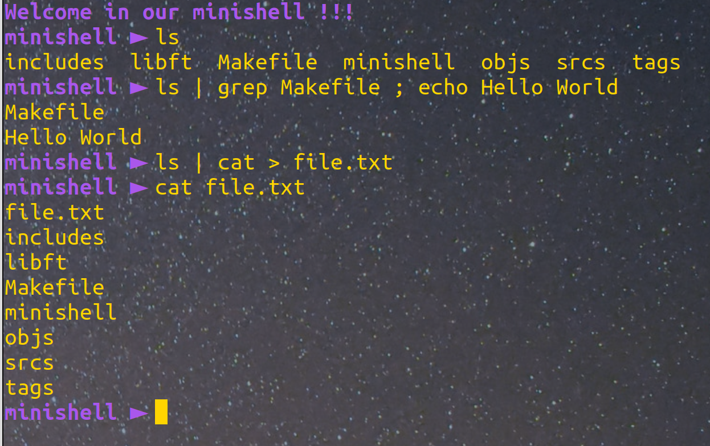
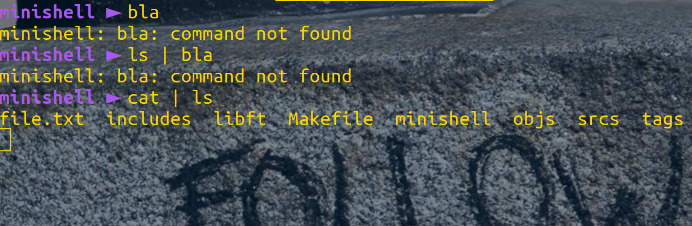

# shell

42 training project, creating my own little shell programm

### How to use it

Using ``make`` will create the ``minishell`` executable.

Simply run it with :

```
./minishell
```

### Available options

Minishell runs executables from an absolute, relative or environment PATH (``/bin/ls`` or ``ls``), including arguments or options. ``'`` and ``"`` work the same as bash, except for multiline commands.

You can separate commands with ``;``, as well as use redirections ``>`` ``>>`` ``<`` and pipes ``|``.

Environment variables are handled, like ``$HOME``, including the return code ``$?``.

Finally, you can use ``Ctrl-C`` to interrupt and ``Ctrl-\`` to quit a program, as well as ``Ctrl-D`` to throw an EOF, same as in bash.

A few of the functions are "built-in", meaning we don't call the executable, we re-coded them directly. It's the case for ``echo``, ``pwd``, ``cd``, ``env``, ``export``, ``unset`` and ``exit``.



### Error handling

Minishell supports wide error handling like wrong command, syntax error, wrong redirect file and other.


